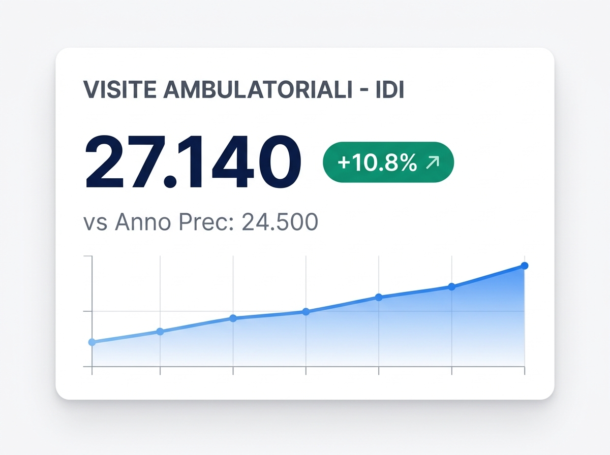
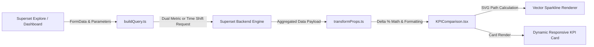

# KPI Comparison Card - Benchmark & Delta % Plugin for Apache Superset

[](LICENSE)
[](https://superset.apache.org/)
[](https://www.typescriptlang.org/)
[](https://reactjs.org/)
[](#)

**KPI Comparison Card** is a custom visualization plugin for **Apache Superset** engineered to display an all-in-one, high-impact executive summary card. It seamlessly combines primary reference metrics, period-over-period or budget benchmarks, absolute difference, automated percentage variance ($\Delta\%$), semantic trend badges, color polarity inversion, and integrated vector sparklines.

---

## 📸 Visual Preview



*Figure 1: KPI Comparison Card displaying current outpatient volume, percentage gain over prior year (+10.8%), absolute delta (+2,640), and an integrated SVG vector sparkline.*

---

## 🌟 Key Features

### 1. 🗂️ All-in-One Compact Executive Card
- **Prominent Primary Value**: Current period or reference metric displayed with high-visibility typography and fluid auto-fitting.
- **Benchmark Comparison Value**: Prior period, budget target, or custom baseline clearly labeled (e.g. `vs Prior Year: 24,500`).
- **Dual Delta Calculations**: Computes both absolute variance ($\text{Ref} - \text{Comp}$) and percentage variance ($\Delta\% = \frac{\text{Ref} - \text{Comp}}{\text{Comp}} \times 100$).
- **Semantic Trend Badges**: Directional indicators (▲ / ▼ / =) with configurable pill, boxed, or text styling.

### 2. 🔄 Dual Calculation Engine (Dual Metric vs. Time Shift)
- **Dual Metric Mode (Dataset / Pre-Aggregated SQL)**:
 - Compares two metrics directly from the SQL query or dataset (e.g., `Current Year Requests` vs `Prior Year Requests`, or `Actual` vs `Budget`).
 - Delivers instant calculations with zero subquery overhead - ideal for pre-aggregated analytical tables.
- **Time Shift Mode (Native Temporal Offset)**:
 - Leverages Superset's native temporal offset engine (`1 year ago`, `1 month ago`, `1 week ago`, `28 days ago`).
 - Automatically queries historical database records and calculates period comparisons on demand.

### 3. 🎯 Color Polarity Inversion ("Lower is Better")
- **Operational & Clinical Metric Support**: In environments such as healthcare, logistics, and cost accounting, a decrease signifies operational improvement (e.g., patient waiting times, ER door-to-doctor intervals, appointment cancellations, defect rates, operating costs).
- **One-Click Inversion**: When enabled, a reduction is highlighted in **Green** and an increase is flagged in **Red**.

### 4. 📈 High-Resolution SVG Vector Sparkline
- **Zero Heavy Charting Dependencies**: Rendered using lightweight, responsive SVG path math directly inside the component.
- **Visual Depth**: Optional semi-transparent gradient fill beneath the curve highlighting temporal velocity and fluctuations.
- **Chronological Sorting**: Automatically driven by a designated date/time dimension.

### 5. 🔠 Fluid Typography & Anti-Collapse Layout
- **Dynamic Viewport Scaling**: Text scales dynamically to fit card boundaries, completely preventing 0px height collapse or awkward line wrapping on multi-column dashboard layouts.
- **Header Omission on Micro-Cards**: Automatically collapses redundant subtitles when embedded in ultra-compact dashboard tiles (< 90px height).

### 6. 🎨 Extensive Aesthetic Customization
- **Background Styling**: Full RGBA color picker with alpha transparency support.
- **Corner Radius Presets**: `Square (0px)`, `Subtle (8px)`, `Rounded (14px)`, and `Pill (24px)`.
- **Card Elevation**: `None (Flat)`, `Subtle Shadow`, `Elevated Shadow`, and `Thin Border`.
- **Formatting Support**: d3-format string presets, currency symbols (`$`, `€`), and unit suffixes (`%`, `days`, `pts`).

---

## 🏛️ Architecture Overview



---

## 📁 Repository Structure

```
superset-plugin-chart-kpi-comparison/
├── package.json                    # Plugin manifest & dependencies
├── tsconfig.json                   # TypeScript build configuration
├── install-plugin.ps1              # Unified PowerShell automated installer
├── install.bat                     # Windows batch menu launcher
├── src/
│   ├── index.ts                    # Plugin entry point & registration
│   ├── types.ts                    # Component & FormData TypeScript definitions
│   ├── plugin/
│   │   ├── index.ts                # ChartPlugin registration & metadata
│   │   ├── buildQuery.ts           # Query constructor (handles time shift & dual metric)
│   │   ├── controlPanel.tsx        # Superset Explore form controls
│   │   └── transformProps.ts       # Numeric deltas, trend badges & formatting
│   ├── components/
│   │   ├── KPIComparison.tsx       # Main React KPI Card component
│   │   └── Sparkline.tsx           # Lightweight native SVG sparkline component
│   └── images/
│       ├── thumbnail.png           # Chart picker thumbnail
│       └── example.png             # Full gallery preview image
└── test/                           # Unit tests & verification
```

---

## 🚀 Quick Installation in Apache Superset

### Option 1: Automated PowerShell Script (Recommended)

Run the installer pointing to your Apache Superset repository:

```powershell
powershell -ExecutionPolicy Bypass -File .\install-plugin.ps1 -SupersetPath "D:\Sviluppo\superset"
```

To perform a clean installation and trigger a Superset frontend recompile:
```powershell
.\install-plugin.ps1 -SupersetPath "D:\Sviluppo\superset" -CleanReinstall -RebuildFrontend
```

The script autonomously:
1. Validates and installs missing npm dependencies (`npm install`).
2. Builds the TypeScript bundle (`tsc --build` / `npm run build`).
3. Syncs compiled files into `superset-frontend/plugins/superset-plugin-chart-kpi-comparison`.
4. Creates a safety backup `MainPreset.ts.bak`.
5. Idempotently registers `KPIComparisonChartPlugin` under the chart key `kpi_comparison`.
6. Flushes Webpack and Babel bundle caches.

### Option 2: Windows Batch Launcher
Double-click:
👉 **`install.bat`**  
Press `[1]` to launch the automated installer.

### Option 3: Manual Installation
1. Copy the plugin directory to `superset-frontend/plugins/superset-plugin-chart-kpi-comparison`.
2. Edit `superset-frontend/src/visualizations/presets/MainPreset.ts`:
   ```typescript
   import { KPIComparisonChartPlugin } from '../../../plugins/superset-plugin-chart-kpi-comparison/src';

   new KPIComparisonChartPlugin().configure({ key: 'kpi_comparison' }).register(),
   ```
3. Clear the cache:
   ```bash
   rm -rf superset-frontend/node_modules/.cache
   ```

---

## 🐳 Docker Compose Deployment

When managing Superset via Docker Compose:

### Non-Dev Environment (Production / Staging)
```bash
cd /path/to/superset
docker compose -f docker-compose-non-dev.yml up -d --build superset
```

### Local Frontend Dev Server
```bash
cd superset-frontend
npm run dev-server
```

Navigate to `http://localhost:8088`, create a new chart, and select **KPI Comparison Card**!

---

## 🛠️ Explore Control Panel Reference

| Section | Control | Type | Description |
|:---|:---|:---|:---|
| **Metrics & Comparison** | `Calculation Mode` | Select | Choose between `Dual Metric` (pre-aggregated SQL) or `Time Shift`. |
| | `Primary Metric` | Metric | Prominent reference metric (e.g. `SUM(current_visits)`). |
| | `Comparison Metric` | Metric | Baseline/target metric when in Dual Metric mode (e.g. `SUM(prior_visits)`). |
| | `Time Shift Offset` | Select | Temporal comparison offset (`1 year ago`, `1 month ago`, etc.). |
| | `Comparison Label` | Text | Descriptive benchmark text (e.g., `"vs Prior Year"`, `"vs Target"`). |
| | `Time Column` | Select | Date/time dimension used to order the vector sparkline. |
| **Card Appearance** | `KPI Title` | Text | Top uppercase heading (e.g., `"TOTAL OUTPATIENT VISITS"`). |
| | `Subtitle` | Text | Secondary context line (e.g., `"Clinical Department - FY 2026"`). |
| | `Card Alignment` | Select | Text alignment: `Left`, `Center`, or `Right`. |
| | `Prefix / Suffix` | Text | Currency symbols (`$`, `€`) or units (`%`, `days`, `hrs`). |
| | `Number Format` | Select | d3-format preset or custom formatting pattern. |
| **Delta % & Polarity** | `Invert Color Polarity` | Checkbox | **"Lower is Better" mode**: decreases turn **Green**, increases turn **Red**. |
| | `Badge Style` | Select | Visual appearance: `Rounded Pill`, `Full Box`, or `Subtle Text`. |
| | `Show Absolute Delta` | Checkbox | Appends numeric difference in parentheses (e.g. `(+2,640)`). |
| **Card Styling** | `Card Background Color`| Color | RGBA color picker with transparency support. |
| | `Border Radius` | Select | Preset radius: `Square (0px)`, `Subtle (8px)`, `Rounded (14px)`, `Pill (24px)`. |
| | `Card Elevation` | Select | Border & shadow style: `None`, `Subtle Shadow`, `Elevated Shadow`, `Thin Border`. |
| **Sparkline** | `Show Sparkline` | Checkbox | Renders inline vector trend curve at the bottom of the card. |
| | `Sparkline Color` | Color | Line stroke color. |
| | `Fill Below Curve` | Checkbox | Adds soft gradient fill below the sparkline curve. |

---

## 💻 Local Development & Build

```bash
# Install dependencies
npm install

# Compile TypeScript sources
npm run build

# Clean build directory
npm run clean
```

---

## 📄 License

Distributed under the **Apache License 2.0**.
